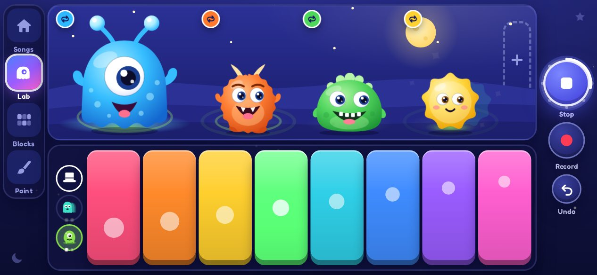
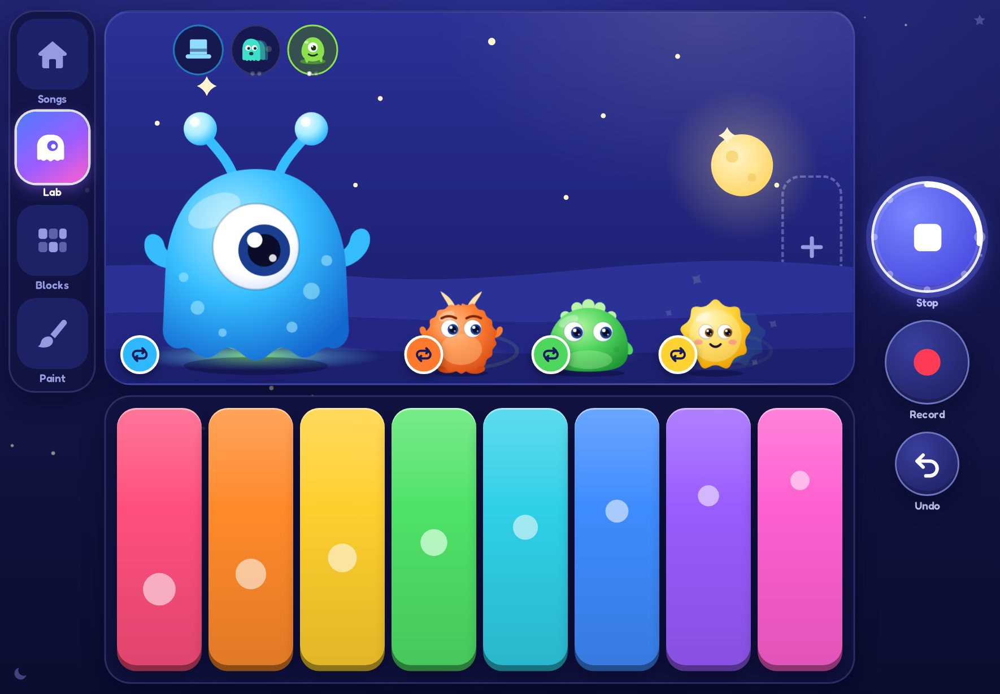
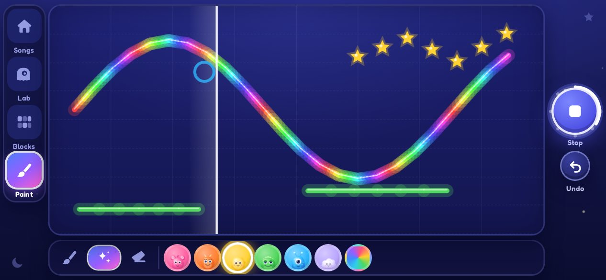
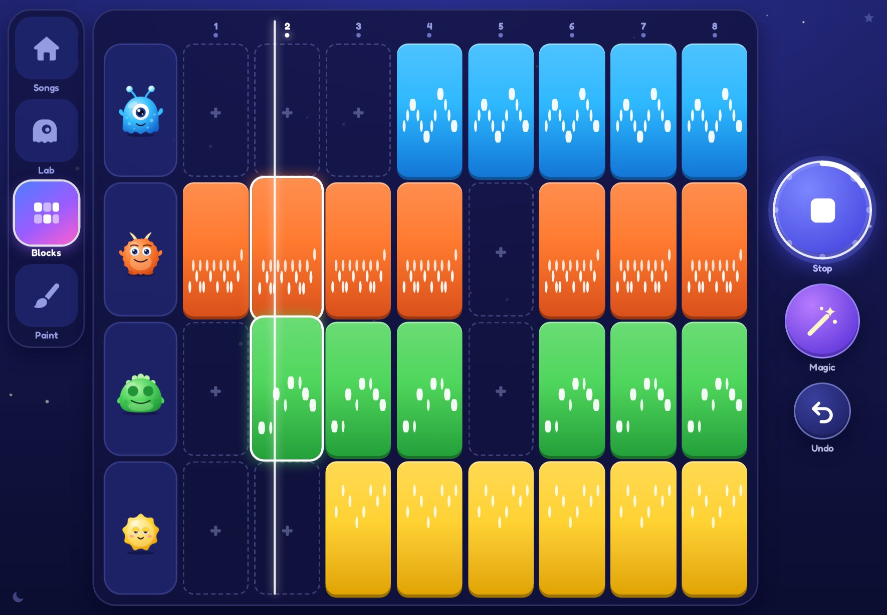

# MONSTER SYNTH

**Make Noise. Make Monsters. Make Music.**

A tablet-first creative music toy for children aged about 3–10. It is built from first principles around how young children explore: touch a monster and it sings, and nothing you play is ever a wrong note. Press record and your music loops. Stack monsters into a band, arrange blocks into a song, paint melodies, or teach Mimic to sing "banana".

> *Make music before you know how music works.*

| Phone held sideways | Tablet |
|---|---|
|  |  |
|  |  |

## What's in 0.1

* **Monster Lab**: every monster on one stage. Touch a monster to play it and put it on the 8 big keys. Squish it: drag up and down for pitch, sideways for Dark ↔ Sparkly, hold for sustain or a roll, shake for wobble, pinch to squish or stretch.
* **Four core monsters**: Bloop (lead), Boom (drums), Grumble (bass), Spark (bells). **Puff** (pads) and **Mimic** (voice sampler) join through *Add Monster*. There are 25 synthesised sounds, and each one is a monster costume.
* **Monster Magic**: scale locking (pentatonic by default), soft quantisation, "first note is the downbeat" looping, replace-don't-pile-up overdubs, auto-stop, and automatic song arrangement.
* **Loops**: record, play, stop and undo. Every monster shares one clock, so loops always line up.
* **Monster Blocks**: the song as rows of blocks. Tap, swipe or drag to change it, then play it through to a finale ("You made a song!").
* **Sound Painting**: draw music. Colour picks the monster, height is pitch, and left-to-right is time.
* **Effect buddies**: Echo (delay), Gloop (reverb), Chomper (crunch) and Wiggle (wobble). Each one is animated on the monster.
* **Two modes**: *Little Monster* (3–5) and *Monster Maker* (6–10, adds speed, mood, more pads and effects, redo, solo and names).
* **My Songs**: a shelf of song pictures. It autosaves; there is never a save dialog.
* **Parent Space**: hold ☾ and ★ in the corners for 3 s. It has age mode, a volume ceiling, microphone permission, motion, contrast and hint settings, song management, WAV export and privacy information.
* **Safe by design**: no accounts, ads, purchases, chat, tracking or network calls. Everything stays on the device. It installs as an offline PWA.

## Quick start

```bash
npm install
npm run dev          # http://localhost:5173 (use --host to try it on a tablet on the same Wi-Fi)
npm run build        # type-check + production build with offline service worker → dist/
npm run preview      # serve the production build
npm test             # unit tests (Vitest) for the music logic and data model
```

Browser checks use Playwright with Chromium:

```bash
npx vite --port 5173 &              # dev server (the extended checks import modules from it)
node scripts/e2e.mjs                # touch→sound, record, layer, play, undo, autosave
node scripts/e2e-more.mjs           # Blocks, Paint, Add Monster, Mimic (fake mic), grown-up gate, WAV export
node scripts/audio-levels.mjs       # offline-render every preset, report peak/RMS, worst-case mix
node scripts/tour.mjs               # screenshots of every screen at phone / tablet / portrait sizes
```

On iPad or Android: open the dev or preview URL in Safari/Chrome, then *Add to Home Screen* to run it full-screen and offline. The first tap wakes the monsters, and that tap is also what browsers require before sound can play.

## Architecture in one picture

```
src/ui/      Presentation & monster interaction   React, SVG monsters, gestures, WAAPI animation
   │  gestures ↓           ↑ note visuals at the moment they are heard
src/studio/  Monster Magic runtime                touch → in-scale notes, recording, transport, export
src/magic/   Monster Magic rules (pure)           scales, quantize, looper rules, sequencing, arrangement
   │  noteOn / trigger ↓
src/audio/   Audio engine (Web Audio only)        voices, presets-as-data, echo/reverb, limiter, scheduler
src/model/ + src/store/                           versioned project schema, undo history, IndexedDB autosave
```

The layers are separated so that UI experiments never require rewriting the audio engine. See [docs/04-component-architecture.md](docs/04-component-architecture.md).

## Design documents

| # | Document |
|---|---|
| 1 | [Product information architecture](docs/01-information-architecture.md), including deviations from the reference mock-ups |
| 2 | [Core user flows](docs/02-user-flows.md) |
| 3 | [Monster Lab screen specification](docs/03-monster-lab-spec.md) |
| 4 | [Component architecture](docs/04-component-architecture.md) |
| 5 | [Design-token system](docs/05-design-tokens.md) |
| 6 | [Core monster character specifications](docs/06-monster-characters.md) |
| 7 | [Audio-engine architecture](docs/07-audio-engine.md) |
| 8 | [Monster Magic rules](docs/08-monster-magic.md) |
| 9 | [Project data model](docs/09-data-model.md) |
| 10 | [MVP development roadmap](docs/10-roadmap.md) |
| 11 | [Product test plan (behavioural)](docs/11-product-testing.md) |

## Tech

React 19 · TypeScript · Vite · Web Audio API (no audio libraries or samples) · zustand · IndexedDB · vite-plugin-pwa (Workbox) · Fredoka (self-hosted, SIL OFL) · Vitest · Playwright.

Targets iPad, Android tablets, Chromebooks and desktop browsers. Phones are supported held sideways.
